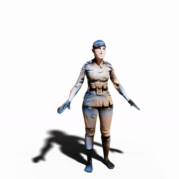
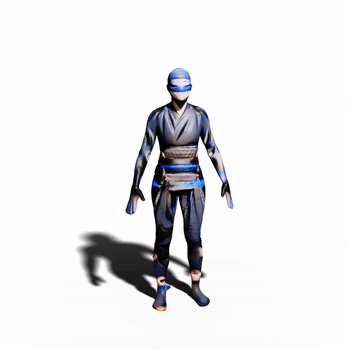
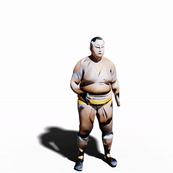
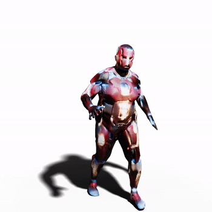
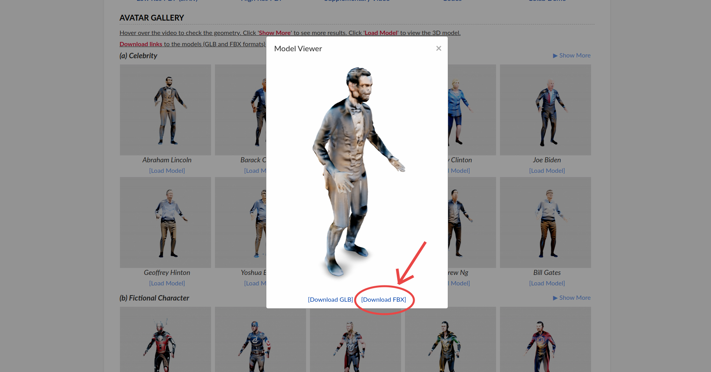
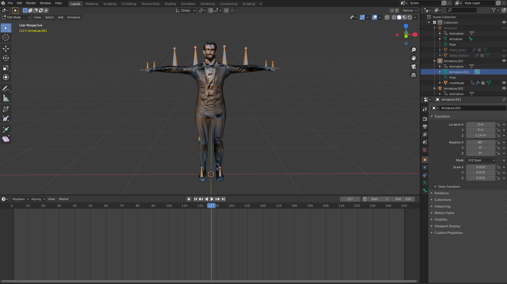
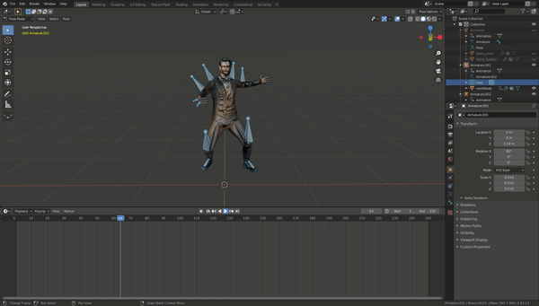
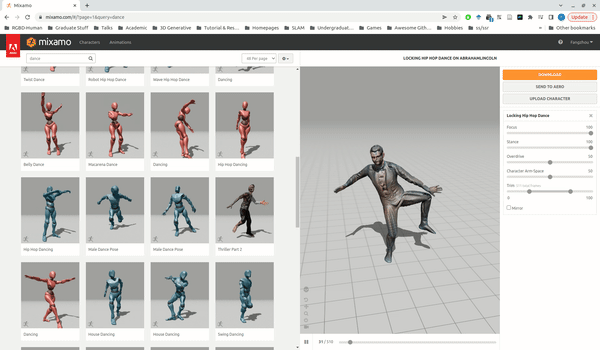

<div align="center">

<h1>AvatarCLIP: Zero-Shot Text-Driven Generation and Animation of 3D Avatars</h1>

<div>
    <a href='https://hongfz16.github.io/' target='_blank'>Fangzhou Hong</a><sup>1</sup>*&emsp;
    <a href='https://scholar.google.com/citations?user=2QLD4fAAAAAJ&hl=en' target='_blank'>Mingyuan Zhang</a><sup>1</sup>*&emsp;
    <a href='https://scholar.google.com/citations?user=lSDISOcAAAAJ&hl=zh-CN' target='_blank'>Liang Pan</a><sup>1</sup>&emsp;
    <a href='https://caizhongang.github.io/' target='_blank'>Zhongang Cai</a><sup>1,2,3</sup>&emsp;
    <a href='https://yanglei.me/' target='_blank'>Lei Yang</a><sup>2</sup>&emsp;
    <a href='https://liuziwei7.github.io/' target='_blank'>Ziwei Liu</a><sup>1+</sup>
</div>
<div>
    <sup>1</sup>S-Lab, Nanyang Technological University&emsp;
    <sup>2</sup>SenseTime Research&emsp;
    <sup>3</sup>Shanghai AI Laboratory
</div>
<div>
    *equal contribution&emsp;
    <sup>+</sup>corresponding author
</div>

<strong>Accepted to <a href='https://s2022.siggraph.org/' target='_blank'>SIGGRAPH 2022</a> (Journal Track)</strong>

<h3>TL;DR</h3>
<h4>AvatarCLIP generate and animate avatars given descriptions of <span style="color:#0a939d">body shapes</span>, <span style="color:#EE9B00">appearances</span> and <span style="color:#AE2011">motions</span>.</h4>

<table>
<tr>
    <td></td>
    <td></td>
    <td></td>
    <td></td>
</tr>
<tr>
    <td align='center' width='24%'>A <span style="color:#0a939d">tall and skinny</span> <span style="color:#EE9B00">female soldier</span> that is <span style="color:#AE2011">arguing</span>.</td>
    <td align='center' width='24%'>A <span style="color:#0a939d">skinny</span> <span style="color:#EE9B00">ninja</span> that is <span style="color:#AE2011">raising both arms</span>.</td>
    <td align='center' width='24%'>An <span style="color:#0a939d">overweight</span> <span style="color:#EE9B00">sumo wrestler</span> that is <span style="color:#AE2011">sitting</span>.</td>
    <td align='center' width='24%'>A <span style="color:#0a939d">tall and fat</span> <span style="color:#EE9B00">Iron Man</span> that is <span style="color:#AE2011">running</span>.</td>
<tr>
</table>

This repository contains the official implementation of _AvatarCLIP: Zero-Shot Text-Driven Generation and Animation of 3D Avatars_.

---

<h4 align="center">
  <a href="https://hongfz16.github.io/projects/AvatarCLIP.html" target='_blank'>[Project Page]</a> •
  <a href="https://arxiv.org/abs/2205.08535" target='_blank'>[arXiv]</a> •
  <a href="https://drive.google.com/file/d/1_-5JIWyRCF7osAVWQ-z01nme4NxBTtrC/view?usp=sharing" target='_blank'>[High-Res PDF (166M)]</a> •
  <a href="https://youtu.be/-l2ZMeoASGY" target='_blank'>[Supplementary Video]</a> •
  <a href="https://colab.research.google.com/drive/1dfaecX7xF3nP6fyXc8XBljV5QY1lc1TR?usp=sharing" target='_blank'>[Colab Demo]</a>
</h4>

</div>

## Updates
[05/2022] [Paper](https://arxiv.org/abs/2205.08535) uploaded to arXiv. [](https://arxiv.org/abs/2205.08535)

[05/2022] Add a [Colab Demo](https://colab.research.google.com/drive/1dfaecX7xF3nP6fyXc8XBljV5QY1lc1TR?usp=sharing) for avatar generation! [](https://colab.research.google.com/drive/1dfaecX7xF3nP6fyXc8XBljV5QY1lc1TR?usp=sharing)

[05/2022] Support converting the generated avatar to the **animatable FBX format**! Go checkout [how to use the FBX models](#use-generated-fbx-models). Or checkout the [instructions](./Avatar2FBX/README.md) for the conversion codes.

[05/2022] Code release for avatar generation part!

[04/2022] AvatarCLIP is accepted to SIGGRAPH 2022 (Journal Track):partying_face:!

## Citation
If you find our work useful for your research, please consider citing the paper:
```
@article{hong2022avatarclip,
    title={AvatarCLIP: Zero-Shot Text-Driven Generation and Animation of 3D Avatars},
    author={Hong, Fangzhou and Zhang, Mingyuan and Pan, Liang and Cai, Zhongang and Yang, Lei and Liu, Ziwei},
    journal={ACM Transactions on Graphics (TOG)},
    volume={41},
    number={4},
    articleno={161},
    pages={1--19},
    year={2022},
    publisher={ACM New York, NY, USA},
    doi={10.1145/3528223.3530094},
}
```

## Use Generated FBX Models

### Download

Go visit our [project page](https://hongfz16.github.io/projects/AvatarCLIP.html). Go to the section 'Avatar Gallery'. Pick a model you like. Click 'Load Model' below. Click 'Download FBX' link at the bottom of the pop-up viewer.



### Import to Your Favourite 3D Software (e.g. Blender, Unity3D)

The FBX models are already rigged. Use your motion library to animate it!





### Upload to Mixamo

To make use of the rich motion library provided by [Mixamo](https://www.mixamo.com), you can also upload the FBX model to Mixamo. The rigging process is completely automatic!



## Installation

We recommend using anaconda to manage the python environment. The setup commands below are provided for your reference.

```bash
git clone https://github.com/hongfz16/AvatarCLIP.git
cd AvatarCLIP
conda create -n AvatarCLIP python=3.7
conda activate AvatarCLIP
conda install pytorch==1.7.0 torchvision==0.8.0 torchaudio==0.7.0 cudatoolkit=10.1 -c pytorch
pip install -r requirements.txt
```

Other than the above steps, you should also install [neural_renderer](https://github.com/daniilidis-group/neural_renderer) following its instructions. Before compiling neural_renderer (or after compiling should also be fine), remember to add the following three lines to `neural_renderer/perspective.py` after line 19.

```python
x[z<=0] = 0
y[z<=0] = 0
z[z<=0] = 0
```

This quick fix is for a rendering issue where objects behide the camera will also be rendered. Be careful when using this fixed version of neural_renderer on your other projects, because this fix will cause the rendering process not differentiable.

## Data Preparation

### Download SMPL Models
Register and download SMPL models [here](https://smpl.is.tue.mpg.de/). Put the downloaded models in the folder `smpl_models`. The folder structure should look like

```
./
├── ...
└── smpl_models/
    ├── smpl/
        ├── SMPL_FEMALE.pkl
        ├── SMPL_MALE.pkl
        └── SMPL_NEUTRAL.pkl
```

### Download Pretrained Models & Other Data
This download is only for coarse shape generation. You can skip if you only want to use other parts. Download the pretrained weights and other required data [here](https://1drv.ms/u/s!AjLpFg-f48ljgZl9qpU7_6ZA9B7qwA?e=pPcHIG). Put them in the folder `AvatarGen` so that the folder structure should look like

```
./
├── ...
└── AvatarGen/
    └── ShapeGen/
        └── data/
            ├── codebook.pth
            ├── model_VAE_16.pth
            ├── nongrey_male_0110.jpg
            ├── smpl_uv.mtl
            └── smpl_uv.obj
```


## Avatar Generation

### Coarse Shape Generation

Folder `AvatarGen/ShapeGen` contains codes for this part. Run the follow command to generate the coarse shape corresponding to the shape description 'a strong man'. We recommend to use the prompt augmentation 'a 3d rendering of xxx in unreal engine' for better results. The generated coarse body mesh will be stored under `AvatarGen/ShapeGen/output/coarse_shape`.

```bash
python main.py --target_txt 'a 3d rendering of a strong man in unreal engine'
```

Then we need to render the mesh for initialization of the implicit avatar representation. Use the following command for rendering.

```bash
python render.py --coarse_shape_obj output/coarse_shape/a_3d_rendering_of_a_strong_man_in_unreal_engine.obj --output_folder ${RENDER_FOLDER}
```

### Shape Sculpting and Texture Generation

Note that all the codes are tested on NVIDIA V100 (32GB memory). Therefore, in order to run on GPUs with lower memory, please try to scale down the network or tune down `max_ray_num` in the config files. You can refer to `confs/examples_small/example.conf` or our [colab demo](https://colab.research.google.com/drive/1dfaecX7xF3nP6fyXc8XBljV5QY1lc1TR?usp=sharing) for a scale-down version of AvatarCLIP.

Folder `AvatarGen/AppearanceGen` contains codes for this part. We provide data, pretrained model and scripts to perform shape sculpting and texture generation on a zero-beta body (mean shape defined by SMPL). We provide many example scripts under `AvatarGen/AppearanceGen/confs/examples`. For example, if we want to generate 'Abraham Lincoln', which is defined in the config file `confs/examples/abrahamlincoln.conf`, use the following command.

```bash
python main.py --mode train_clip --conf confs/examples/abrahamlincoln.conf
```

Results will be stored in `AvatarCLIP/AvatarGen/AppearanceGen/exp/smpl/examples/abrahamlincoln`.

If you wish to perform shape sculpting and texture generation on the previously generated coarse shape. We also provide example config files in `confs/base_models/astrongman.conf` `confs/astrongman/*.conf`. Two steps of optimization are required as follows.

```bash
# Initilization of the implicit avatar
python main.py --mode train --conf confs/base_models/astrongman.conf
# Shape sculpting and texture generation on the initialized implicit avatar
python main.py --mode train_clip --conf confs/astrongman/hulk.conf
```

### Marching Cube

To extract meshes from the generated implicit avatar, one may use the following command.

```bash
python main.py --mode validate_mesh --conf confs/examples/abrahamlincoln.conf
```

The final high resolution mesh will be stored as `AvatarCLIP/AvatarGen/AppearanceGen/exp/smpl/examples/abrahamlincoln/meshes/00030000.ply`

## Convert Avatar to FBX Format

For the convenience of using the generated avatar with modern graphics pipeline, we also provide scripts to rig the avatar and convert to FBX format. See the instructions [here](./Avatar2FBX/README.md).


## Motion Generation

TBA


## License

Distributed under the MIT License. See `LICENSE` for more information.


## Related Works
<p>There are lots of wonderful works that inspired our work or came around the same time as ours.</p>
<p><a href="https://arxiv.org/abs/2112.01455">Dream Fields</a> enables zero-shot text-driven general 3D object generation using CLIP and NeRF.</p>
<p><a href="https://arxiv.org/abs/2112.03221">Text2Mesh</a> proposes to edit a template mesh by predicting offsets and colors per vertex using CLIP and differentiable rendering.</p>
<p><a href="https://arxiv.org/abs/2112.05139">CLIP-NeRF</a> can manipulate 3D objects represented by NeRF with natural languages or examplar images by leveraging CLIP.</p>
<p><a href="https://arxiv.org/abs/2203.13333">Text to Mesh</a> facilitates zero-shot text-driven general mesh generation by deforming from a sphere mesh guided by CLIP.</p>
<p><a href='https://github.com/GuyTevet/MotionCLIP'>MotionCLIP</a> establishes a projection from the CLIP text space to the motion space through supervised training, which leads to amazing text-driven motion generation results.</p>

## Acknowledgements

This study is supported by NTU NAP, MOE AcRF Tier 2 (T2EP20221-0033), and under the RIE2020 Industry Alignment Fund – Industry Collaboration Projects (IAF-ICP) Funding Initiative, as well as cash and in-kind contribution from the industry partner(s).

We thank the following repositories for their contributions in our implementation: [NeuS](https://github.com/Totoro97/NeuS), [smplx](https://github.com/vchoutas/smplx), [vposer](https://github.com/nghorbani/human_body_prior), [Smplx2FBX](https://github.com/mrhaiyiwang/Smplx2FBX).
